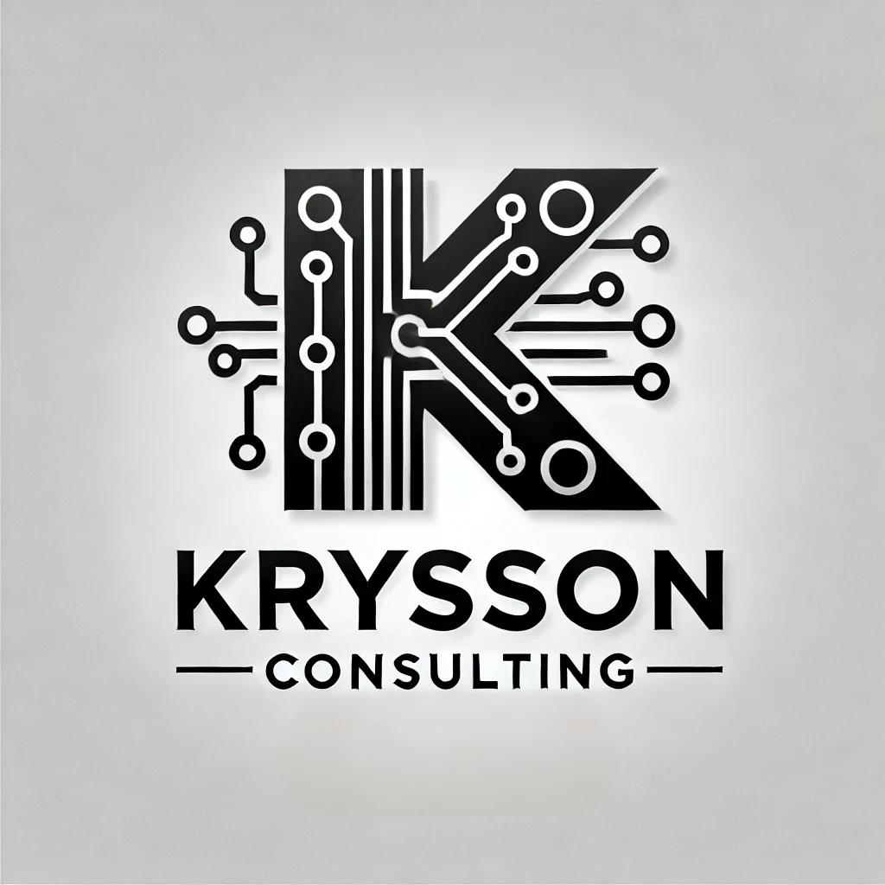

# Krysson Notes

---

#### A Note taking app for use in law school

$\color{Apricot}{Notion\ clone\ designed\ for\ Law\ School\ Students\ .}$

---

##### Planned Features

- Note Tagging

  - Connect & Search by Tag
  - CRUD Tags

- Notes

  - Markdown in note editor
    - Note templates
      - IRAC
  - Like Notion - Use Novel for rich text and "/" integration?

- Calendar

  - Assignments
  - reading
  - Deadlines

- Kanban

  - Not Started / Stuck / In progress / Complete

- Database like functionality

  - Classes
  - Assignments
  - Deadlines
  - Important Dates

- AI aspects

  - Auto completion
  - case lookup - Using free resources
  - Case summarization - defined to act as law student

- Writting center
  - legal writting templates
    - memos
    - case briefs

---

##### Coding Requirements / Framework / Technologies

Needs to be locally installable if wanted - Own your data

Needs to be accessable from any device

Needs to be able save large or potentialy large files (pdfs, video, etc)

- Mongo.db
- Express.js
- React.js / Next.js
- Node.js
   
   
- Python?
- Django?
   
  > Coded By: Krysson

